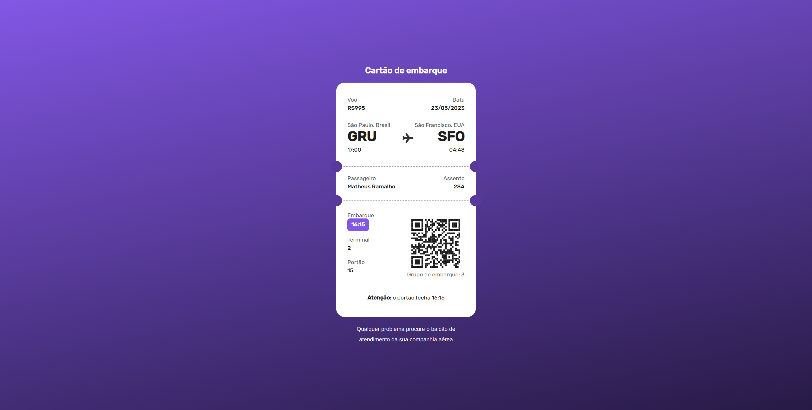

<h1 align="center"> Boarding pass </h1>

  Desafio da Rocketseat, layout base no figma apenas.

  <a href="#-tecnologias">Tecnologias</a>&nbsp;&nbsp;&nbsp;|&nbsp;&nbsp;&nbsp;
  <a href="#-projeto">Projeto</a>&nbsp;&nbsp;&nbsp;|&nbsp;&nbsp;&nbsp;
  <a href="#-layout">Layout</a>&nbsp;&nbsp;&nbsp;|&nbsp;&nbsp;&nbsp;
  <a href="#memo-licença">Licença</a>

  

 

  

## 🚀 Tecnologias

Esse projeto foi desenvolvido com as seguintes tecnologias:

- Vite
- React
- TypeScript
- Styled-components
- Git
- Github

## 💻 Projeto

Cartão de embarque de um voo.

## 🔖 Layout

Você pode visualizar o layout do projeto através [DESSE LINK](https://www.figma.com/file/fVpDoFq9XLWuJa8csrPpdv/%23boraCodar---Desafio-6-(Community)?node-id=1%3A878&t=CHfu66LRCBEwUIlb-0).

## :memo: Licença

Esse projeto está sob a licença MIT.

---

Projeto proposto pela Rocketseat como desafio  
by Matheus Ramalho - [matheusramalho.dev](matheusramalho.dev)
